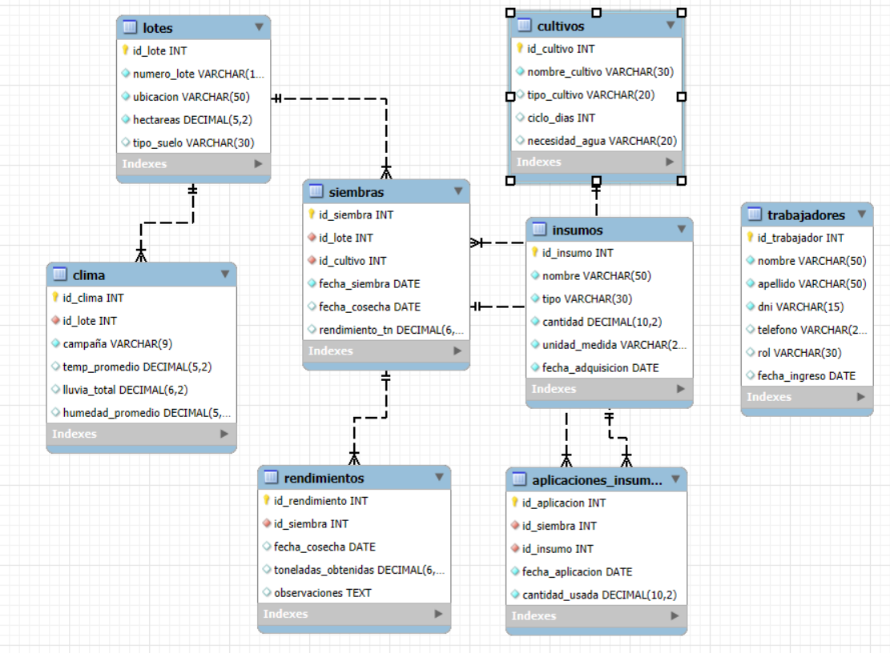

# Proyecto Base de Datos – Agricultura

## Descripción de la temática
El proyecto consiste en el diseño y desarrollo de una base de datos relacional orientada a la gestión de información en el ámbito agrícola. El objetivo es almacenar, organizar y relacionar datos clave vinculados a la producción agrícola, desde la planificación y registro de siembras, hasta la aplicación de insumos, condiciones climáticas y resultados de rendimiento.

La base de datos contempla información de:
- **Lotes**: identificación y características de cada parcela de cultivo.
- **Cultivos**: tipo de cultivo, variedad y ciclo productivo.
- **Trabajadores**: personal involucrado en las distintas tareas agrícolas.
- **Insumos**: productos utilizados (fertilizantes, pesticidas, semillas, etc.).
- **Siembras**: registro de fechas, cultivos y lotes sembrados.
- **Aplicaciones de insumos**: uso de insumos sobre determinadas siembras, indicando fecha y cantidad.
- **Clima**: condiciones meteorológicas registradas en fechas específicas y asociadas a lotes.
- **Rendimientos**: producción obtenida al final del ciclo productivo de cada siembra.

Esta estructura permite gestionar información de forma centralizada y facilita el análisis para la toma de decisiones, optimizando recursos, mejorando la planificación y evaluando los resultados productivos.

## Diagrama Entidad–Relación
A continuación se presenta el diagrama E–R del modelo de base de datos, que representa las entidades, sus atributos y relaciones.

